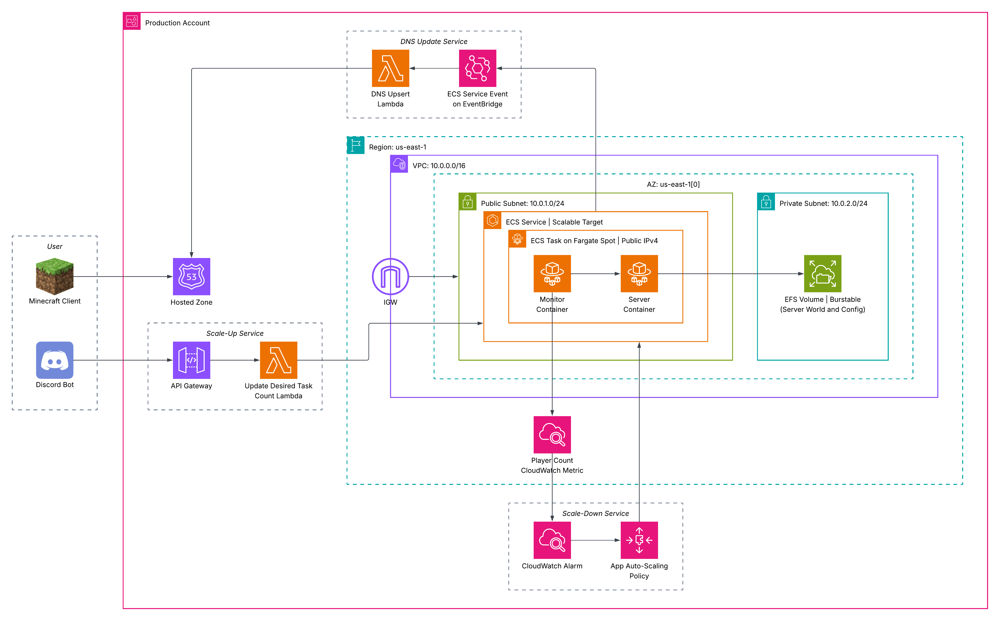

# Mine Scale: Scalable Minecraft Hosting on AWS

Minimize your Minecraft multiplayer server hosting expense with a near-zero idle cost architecture
on AWS.

## Description

Why pay for 24/7 managed game server hosting when you only play a few hours a week? Mine Scale is a
**CloudFormation** deployment using **AWS ECS Fargate** and **Amazon EFS** that decouples stateful
game data from compute, so you pay only for the hours you actually play.

- **Automatic Idle Shutdown:** A CloudWatch Alarm detects prolonged inactivity and triggers an
  Application Auto Scaling policy that scales the ECS service's task count to `0`.

- **On-Demand Wake Up:** A Discord slash command (`/wake`), backed by an AWS Lambda microservice,
  scales the server back up when you're ready to play.

- **Automated DNS:** A Lambda function updates the Route 53 record whenever EventBridge detects a
  new ECS task deployment, so players always connect using the same domain name.

## Table of Contents

- [Security & Cost Considerations](#security--cost-considerations)
- [Architecture Overview](#architecture-overview)
- [Cost Estimate](#cost-estimate)
- [Getting Started](#getting-started)
  - [Prerequisites](#prerequisites)
  - [Environment Creation](#environment-creation)
  - [Pre-Deployment Preparation](#pre-deployment-preparation)
- [Installation & Deployment](#installation--deployment)
  - [Stack Structure](#stack-structure)
  - [Phase 1: Environment Setup](#phase-1-environment-setup)
  - [Phase 2: DNS & IAM Deployment](#phase-2-dns--iam-deployment)
  - [Phase 3: Core Infrastructure Deployment](#phase-3-core-infrastructure-deployment)
  - [Phase 4: Compute & Control Deployment](#phase-4-compute--control-deployment)
  - [Phase 5: Discord Bot Authorization](#phase-5-discord-bot-authorization)
- [Using Mine Scale](#using-mine-scale)
  - [Waking the Server](#waking-the-server)
  - [Administering via RCON](#administering-via-rcon)
  - [Connecting to the Server](#connecting-to-the-server)
- [Tearing Down](#tearing-down)
- [Version History](#version-history)
- [Authors](#authors)
- [License](#license)
- [Acknowledgments](#acknowledgments)

## Security & Cost Considerations

> **Important Notices Before Deployment**
>
> - **Sensitive Data:** Never commit `.env.sh`. It holds live AWS profile names, Discord credentials,
>   and your RCON password. Verify it is excluded via `.gitignore` prior to your first push.
>
> - **AWS Charges:** Deployed resources will incur real charges on your AWS account. Review the
>   [Cost Estimate](#cost-estimate) section before proceeding.
>
> - **Unencrypted RCON:** RCON traffic is unencrypted. Access is restricted to your `ADMIN_IP` via
>   Security Group rules for this reason. Do not open port `25575` more broadly.
>
> - **Fargate Spot:** Compute tasks run on Fargate Spot to optimize costs. Spot capacity can
>   occasionally be reclaimed by AWS with short notice, which would interrupt an active session.

## Architecture Overview



### Execution Paths & Components

- **Wake Path:** A player runs `/wake` in Discord, routing through API Gateway to the Scale-Up
  Lambda, which sets the ECS task count to `1`. Once the Fargate Spot task starts, EventBridge
  invokes the DNS Upsert Lambda to update Route 53 with the task's new public IP. Updating DNS
  only after the task is confirmed running keeps DNS accurate even if startup is slow.

- **Sleep Path:** A sidecar Monitor container periodically publishes a player-count CloudWatch
  metric. When that metric reads zero players over the evaluation window, a CloudWatch Alarm
  triggers Application Auto Scaling to scale task count to `0`.

- **Persistent State:** World data and server configurations reside on an EFS volume mounted into a
  private subnet, decoupling game state from container lifecycles. World data survives scale-down
  without snapshotting or backup steps.

- **Network & Compute Tradeoffs:** Tasks run in a public subnet with a public IP rather than behind
  a NAT Gateway to eliminate high fixed hourly charges. Storage uses EFS Burstable throughput mode
  for cost efficiency, though it may throttle under sustained heavy read/write operations such as
  massive world generation.

## Cost Estimate

Cost scales directly with how much you play, so you're not paying for a server that idles 24/7.
Below is a sample monthly estimate for typical casual usage (Fargate on-demand rates, `us-east-1`;
actual rates vary by region):

| Component | Assumption | Monthly Cost |
| - | - | - |
| Fargate compute (1 vCPU / 2 GB) | ~8 hrs/week (~35 hrs/month) active | ~$1.75 |
| EFS storage (world + config) | 2–10 GB, Standard storage class | $0.60 – $3.00 |
| Route 53 hosted zone | Fixed fee | $0.50 |
| **Estimated total** | | **~$3 – $5/month** |

*Excludes AWS Free Tier eligibility, data transfer, CloudWatch Logs retention, and Lambda invocation
costs, all of which are negligible at this scale. Fargate Spot (used for the server task) is roughly
70% cheaper than on-demand, so actual compute cost is likely lower than shown; the table uses
on-demand rates as a conservative upper bound.*

A typical managed Minecraft host charges $10–$30+/month regardless of active playing time.

## Getting Started

### Prerequisites

Ensure you have the following installed and configured before deploying:

1. **Local Environment:** A Unix-like shell environment with [Docker](https://www.docker.com/) and
    the [AWS CLI v2](https://docs.aws.amazon.com/cli/latest/userguide/getting-started-install.html)
    installed.

1. **AWS Account & SSO Profiles:**

    An AWS account with two SSO users and two corresponding CLI profiles (using the same AWS Region):

    - An administrator user with the managed `AdministratorAccess` policy.

    - A developer user with the managed `PowerUserAccess` policy plus an inline policy allowing
      `iam:PassRole` for execution, task, and Lambda roles created in Phase 2.

    ```json
    {
      "Version": "2012-10-17",
      "Statement": [
        {
          "Sid": "AllowPassingNeededExecutionRoles",
          "Effect": "Allow",
          "Action": "iam:PassRole",
          "Resource": [
            "arn:aws:iam::<your account id>:role/ecs-execution-role",
            "arn:aws:iam::<your account id>:role/ecs-task-role",
            "arn:aws:iam::<your account id>:role/dns-update-lambda-role",
            "arn:aws:iam::<your account id>:role/wake-lambda-role"
          ]
        }
      ]
    }
    ```

    *Note: copy the region and profile names you set into `AWS_REGION`, `AWS_POWUSR_PROFILE`, and
    `AWS_ADMIN_PROFILE` inside `.env.sh`.*

1. **Domain Name:** A domain registered in Amazon Route 53 with a default public hosted zone.

1. **Discord Application:**

    A Discord app created via the
    [Discord Developer Portal](https://discord.com/developers/applications) with Public Bot toggled
    **OFF** in the Bot section.

    - Retain the Application ID and Public Key from the General Information section.

    - Generate and retain a Bot Token in the Bot section.

    *Note: copy these into `DISCORD_APP_ID`, `DISCORD_PUBLIC_KEY`, and `DISCORD_BOT_TOKEN` inside
    `.env.sh`.*

### Environment Creation

Create a file named `.env.sh` in the repository root. Populate it using the template below:

```bash
# ================================
# 1. SET IN PREREQUISITES SECTION
# ================================
# AWS Account & SSO Profiles
export AWS_REGION="us-east-1"
export AWS_POWUSR_PROFILE="your-developer-profile"
export AWS_ADMIN_PROFILE="your-admin-profile"

# Discord Bot Credentials
export DISCORD_PUBLIC_KEY="your_discord_public_key"
export DISCORD_APP_ID="your_discord_app_id"
export DISCORD_BOT_TOKEN="your_discord_bot_token"

# =====================================
# 2. SET IN ENVIRONMENT CREATION (NOW)
# =====================================
# ECR Repositories (Choose unique names)
export SERVER_ECR_REPO_NAME="mine-scale-server"
export MONITOR_ECR_REPO_NAME="mine-scale-monitor"

# ==========================================
# 3. DEPLOYMENT & OUTPUT VARIABLES
# (Populated during/after script execution)
# ==========================================
export ADMIN_IP=""            # e.g., "1.2.3.4/32"
export PYNACL_ARN=""          # Output from PyNaCl build script
export SERVER_URI=""          # Output from setup.sh
export MONITOR_URI=""         # Output from setup.sh
export SUBDOMAIN=""           # e.g., "subdomain.domain.tld"
export RCON_PASSWORD=""       # Custom password for remote server admin
```

### Pre-Deployment Preparation

1. **Build and Publish the PyNaCl Lambda Layer:**

    ```bash
    cd scripts
    chmod +x build-publish-pynacl-layer.sh
    ./build-publish-pynacl-layer.sh
    ```

1. **Build and Push the Minecraft Server Container:**

    Create a new empty ECR Repository in your AWS account matching `SERVER_ECR_REPO_NAME` in
    `.env.sh`, then run:

    ```bash
    cd minecraft-server
    chmod +x build-push-server.sh
    ./build-push-server.sh
    ```

1. **Build and Push the Activity Monitor Container:**

    Create a new empty ECR Repository in your AWS account matching `MONITOR_ECR_REPO_NAME` in
    `.env.sh`, then run:

    ```bash
    cd activity-monitor
    chmod +x build-push-monitor.sh
    ./build-push-monitor.sh
    ```

## Installation & Deployment

### Stack Structure

Mine Scale is deployed as five separate CloudFormation stacks, split by operational frequency and
blast radius:

| Stack | Contains | Why separate |
| - | - | - |
| **DNS** | Route 53 hosted zone | Rarely changes; isolating prevents breaking domain NS delegation. |
| **IAM** | Execution roles, task roles, Lambda roles | Requires administrator access; isolating ensures elevated access is only needed once. |
| **Core** | VPC, subnets, EFS volume | Foundational infrastructure that changes infrequently. |
| **Compute** | ECS cluster, service, task definition, Auto Scaling, CloudWatch alarm | Iterates often (images, sizing, scaling); redeployable without touching network/IAM/DNS. |
| **Control** | API Gateway, Scale-Up Lambda, DNS Upsert Lambda, EventBridge rule | Discord control plane, deployed independently from the game server. |

### Phase 1: Environment Setup

1. **Initialize Project Environment:**

    Run `setup.sh` to retrieve your current public IP, ECR repo URIs, and Lambda layer details:

    ```bash
    cd scripts
    chmod +x setup.sh
    ./setup.sh
    ```

1. **Update Environment Variables:**

    Open `.env.sh` and populate the remaining fields from `setup.sh`: `ADMIN_IP`, `PYNACL_ARN`,
    `SERVER_URI`, `MONITOR_URI`, and `SUBDOMAIN`.

### Phase 2: DNS & IAM Deployment

1. **Deploy DNS Infrastructure:**

    Authenticate using your developer account when prompted.

    ```bash
    cd scripts/deploy
    chmod +x deploy-dns.sh
    ./deploy-dns.sh
    ```

1. **Link Hosted Zone NS Records:**

    In the AWS account hosting your main domain's Route 53 public zone, create an `NS` record for
    `subdomain.domain.tld` containing the 4 name servers output by `deploy-dns.sh`.

1. **Deploy IAM Roles & Policies:**

    Authenticate using your administrator account when prompted.

    ```bash
    chmod +x deploy-iam.sh
    ./deploy-iam.sh
    ```

### Phase 3: Core Infrastructure Deployment

1. **Deploy Core Networking & Storage:**

    Authenticate using your developer account for this and subsequent steps.

    ```bash
    chmod +x deploy-core.sh
    ./deploy-core.sh
    ```

1. **Configure RCON Remote Access:**

    Set `RCON_PASSWORD` in `.env.sh` to a strong custom password.

### Phase 4: Compute & Control Deployment

1. **Deploy Compute & Auto-Scaling Services:**

    ```bash
    chmod +x deploy-compute.sh
    ./deploy-compute.sh
    ```

1. **Deploy Discord Interaction Microservices:**

    ```bash
    chmod +x deploy-control.sh
    ./deploy-control.sh
    ```

    *Note: Save the `API Endpoint` printed at the end of the output.*

### Phase 5: Discord Bot Authorization

1. **Register Discord Slash Command (`/wake`):**

    ```bash
    cd scripts
    chmod +x register-wake-cmd.sh
    ./register-wake-cmd.sh
    ```

1. **Configure Discord Developer Portal:**

    - Navigate to the [Discord Developer Portal](https://discord.com/developers/applications) and
      open your application.

    - Paste the `API Endpoint` into **Interactions Endpoint URL** under **General Information**.

    - In **OAuth2**, select scopes (`application.commands`, `bot`) and permissions (`Send Messages`,
      `Use Slash Commands`).

    - Authorize the bot for your Discord server using the generated URL.

## Using Mine Scale

### Waking the Server

In any Discord channel where the bot is present, run:

```text
/wake
```

- **Status Check:** Running `/wake` at any time returns status (e.g., `Stopped`, `Starting`, or
  `Running`).

- **First Boot:** Initial provisioning may take 1-2 minutes.

### Administering via RCON

Connect via RCON using [mcrcon](https://github.com/tiiffi/mcrcon) from the machine matching
`ADMIN_IP`:

```bash
mcrcon -H mc.<SUBDOMAIN> -P 25575 -p <YOUR_RCON_PASSWORD>
```

Execute management commands:

```text
whitelist add <PLAYER_NAME>
op <ADMIN_PLAYER_NAME>
```

### Connecting to the Server

Launch Minecraft and connect to:

```text
play.<SUBDOMAIN>
```

## Tearing Down

Because stacks depend on each other, they must be deleted in reverse order of deployment.
CloudFormation deletions are asynchronous; use `wait stack-delete-complete` to ensure dependent
stacks are completely deleted before starting the next step:

```bash
# 1. Control Stack
aws cloudformation delete-stack --stack-name mc-control --profile $AWS_POWUSR_PROFILE
aws cloudformation wait stack-delete-complete --stack-name mc-control --profile $AWS_POWUSR_PROFILE

# 2. Compute Stack
aws cloudformation delete-stack --stack-name mc-compute --profile $AWS_POWUSR_PROFILE
aws cloudformation wait stack-delete-complete --stack-name mc-compute --profile $AWS_POWUSR_PROFILE

# 3. Core Stack
aws cloudformation delete-stack --stack-name mc-core --profile $AWS_POWUSR_PROFILE
aws cloudformation wait stack-delete-complete --stack-name mc-core --profile $AWS_POWUSR_PROFILE

# 4. IAM Stack (Admin access required)
aws cloudformation delete-stack --stack-name mc-iam --profile $AWS_ADMIN_PROFILE
aws cloudformation wait stack-delete-complete --stack-name mc-iam --profile $AWS_ADMIN_PROFILE

# 5. DNS Stack (Requires runtime 'A' record to be deleted manually from Route 53 first)
aws cloudformation delete-stack --stack-name mc-dns --profile $AWS_POWUSR_PROFILE
aws cloudformation wait stack-delete-complete --stack-name mc-dns --profile $AWS_POWUSR_PROFILE
```

**Non-CloudFormation Cleanup:**

- **ECR Images:**

  ```bash
  aws ecr delete-repository --repository-name $SERVER_ECR_REPO_NAME --force
  aws ecr delete-repository --repository-name $MONITOR_ECR_REPO_NAME --force
  ```

- **PyNaCl Lambda Layer:**

  ```bash
  aws lambda delete-layer-version --layer-name <layer-name> --version-number <version>
  ```

- **Delegated NS Record:** Manually remove the NS record added to your parent domain during Phase 2.

## Version History

- **1.0.0**: Initial Release

## Authors

Harper Cline | LinkedIn: [/in/harper-cline](https://linkedin.com/in/harper-cline)

## License

This project is licensed under the MIT License. See the [LICENSE](./LICENSE) file for details.

## Acknowledgments

- README structure adapted from
  [DomPizzie's README Template](https://gist.github.com/DomPizzie/7a5ff55ffa9081f2de27c315f5018afc).
